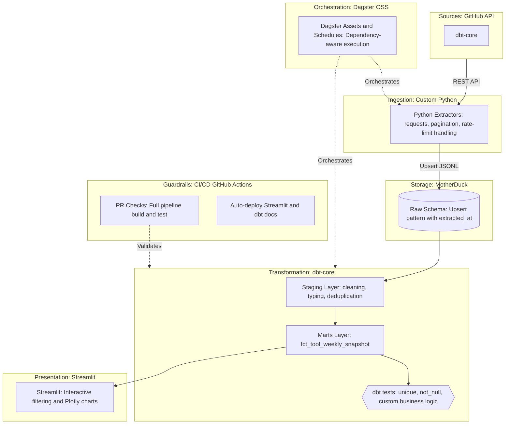

# 🏥 Health of the Modern Data Stack

> Tracking the *real* health of open-source data tools — beyond vanity metrics like GitHub stars. 

This project is a production-grade, end-to-end ELT data pipeline that extracts, transforms, and visualizes the operational health of modern data infrastructure tools (starting with `dbt-core`). It analyzes contribution velocity, issue resolution time, and contributor retention to answer: **"Is this tool actively maintained and healthy?"**

## 📊 Analytical Findings (The Narrative)

While GitHub stars are a popular vanity metric, they don't reflect the day-to-day reality of a project. By analyzing the raw GitHub API data for `dbt-core`, this pipeline reveals:
- **Issue Resolution Velocity**: The average time to close an issue, highlighting how responsive the core maintainers are to community bug reports.
- **PR Merge Rate**: The ratio of opened vs. merged pull requests, indicating how welcoming the project is to external contributions.
- **Contributor Concentration**: Whether the project relies on a tiny core team or has a healthy, distributed community of contributors.

*Note: This dashboard currently tracks `dbt-core`. The architecture is designed to easily scale to `Airflow`, `Dagster`, `Meltano`, and others by adding new extractor modules.*

## 🏗️ Architecture

This is a monorepo demonstrating a modern, asset-based ELT architecture:



## 📂 Project Structure

```text
modern-data-stack-health/
├── ingestion/          # Custom Python extractors (API client, pagination, rate-limit handling)
├── transform/          # dbt-core project (staging, marts, schema tests, custom singular tests)
├── orchestration/      # Dagster OSS assets, schedules, and resources
├── dashboard/          # Streamlit app (Python-native, interactive data product)
├── .github/workflows/  # CI/CD guardrails (dbt build on PR, daily ingestion schedule)
├── run.ps1             # Cross-platform PowerShell wrapper for local development
└── Makefile            # Developer experience shortcuts (for Unix/Git Bash users)
```

## 🚀 How to Run Locally

This project is designed for cross-platform compatibility (Windows PowerShell, Mac, Linux).

### 1. Prerequisites
* Python 3.12 (Recommended for Dagster compatibility)
* A GitHub Personal Access Token (with public_repo scope)
* A free MotherDuck account and token

### 2. Setup
```powershell
# Clone the repo and navigate to it
git clone <your-repo-url>
cd modern-data-stack-health

make setup

cp .env.example .env
# Edit .env and add GITHUB_TOKEN and MOTHERDUCK_TOKEN
```
### 3. Run the pipeline
Use the provided PowerShell wrapper to ensure environment variables are loaded correctly:

```powershell
make ingest
make dbt-run
make dbt-docs
make dagster-up
```

### 4. Run the dashboard
```powershell
cd dashboard
pip install -r requirements.txt
streamlit run app.py
```
(Open http://localhost:8501)

## 🛡️ Engineering Rigor & Guardrails

1. Schema Evolution Handling: The ingestion layer uses an intelligent Upsert pattern that dynamically maps columns, preventing breaks when the GitHub API adds or removes optional fields.
2. Automated Testing: GitHub Actions runs the entire ELT pipeline (ingestion + dbt build) on every Pull Request. If a custom business logic test fails, the PR is blocked.
3. Asset-Based Orchestration: Dagster automatically infers the dependency graph between the raw Python extraction and the dbt transformation models, preventing race conditions.

## 🔗 Live Links
📚 dbt Docs: [https://ricard-alcaraz.github.io/modern-data-stack-health/](https://ricard-alcaraz.github.io/modern-data-stack-health/)

## 📝 License
MIT