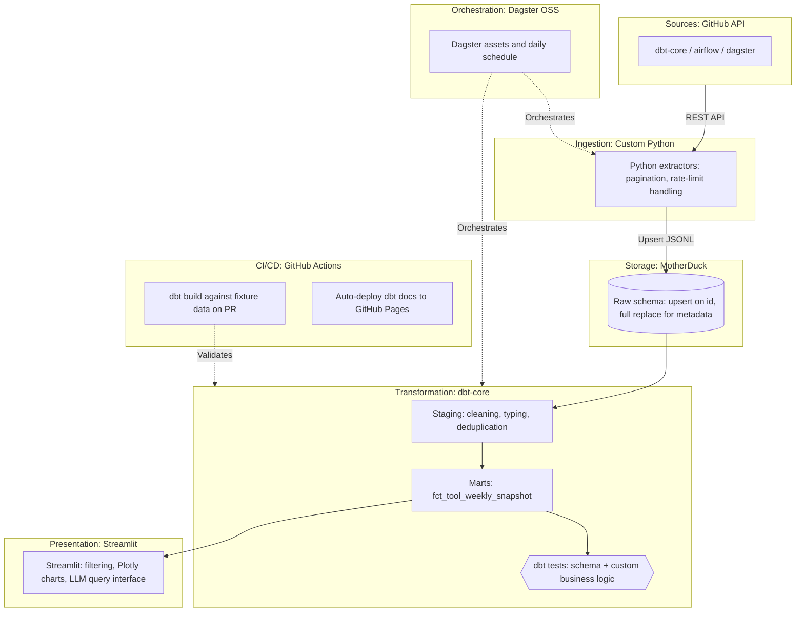

# Modern Data Stack Health

An end-to-end ELT pipeline that tracks the operational health of open-source data infrastructure projects (dbt-core, Airflow, Dagster) using their public GitHub activity — issue resolution time, PR merge rate, and contributor concentration — as a proxy for maintenance health, rather than relying on stars alone.

## Overview

GitHub stars are a popularity signal, not a health signal. This project pulls raw issue, pull request, and release data from the GitHub REST API for a small set of tracked repositories, models it with dbt, and surfaces the results in a Streamlit dashboard with weekly trend charts and a natural-language query interface backed by an LLM.

The project currently tracks:
- `dbt-labs/dbt-core`
- `apache/airflow`
- `dagster-io/dagster`

Adding a new repository means updating the shared tool list and the corresponding staging model.

## Architecture



## Project structure

```text
modern-data-stack-health/
├── ingestion/          # Python extractors (API client, pagination, rate-limit handling)
├── transform/          # dbt project (staging, marts, schema tests, singular tests)
├── orchestration/      # Dagster assets, schedules, and resources
├── dashboard/          # Streamlit app (overview, comparison, contributors, AI analyst)
├── tests/              # Fixture-based test data for CI
├── .github/workflows/  # CI (dbt build on PR) and CD (docs deploy)
└── Makefile            # Local dev shortcuts
```

## Prerequisites

- Python 3.12
- A GitHub personal access token with `public_repo` scope
- A free [MotherDuck](https://motherduck.com/) account and token

## Setup

```bash
git clone https://github.com/ricard-alcaraz/modern-data-stack-health.git
cd modern-data-stack-health

make setup

cp .env.example .env
# Edit .env and set your variables
```

## Running the pipeline

```bash
make ingest      # Pull raw data from GitHub into MotherDuck
make dbt-run     # Build staging and mart models
make dbt-docs    # Generate and serve dbt docs locally
make dagster-up  # Start the Dagster UI to run/schedule the pipeline as assets
```

## Running the dashboard

```bash
cd dashboard
pip install -r requirements.txt
streamlit run app.py
```

Open `http://localhost:8501`. The dashboard has four pages: a weekly activity overview, a cross-tool comparison, contributor analysis, and an AI analyst page that translates natural-language questions into SQL against a small predefined semantic layer.

## Testing and CI

- `dbt build` runs schema tests (`unique`, `not_null`, `accepted_values`) plus a singular test asserting an issue can't close before it opens.
- CI (`.github/workflows/ci-dbt.yml`) loads static fixtures into a local DuckDB file and runs `dbt build --target ci` on every PR touching `transform/`. It does not call the GitHub API, so it's deterministic and doesn't consume rate limit.
- `dbt_project.yml`/`profiles.yml` define separate `dev`, `ci`, and `prod` targets so local iteration doesn't write to the production MotherDuck database by default.

## Known limitations

- Tracks a fixed, small set of repositories; scaling to many more tools would need a config-driven source list rather than hardcoded tuples.
- The AI analyst page depends on an external LLM API (OpenAI) or a local LM Studio instance; query correctness isn't guaranteed and results should be spot-checked against the dashboard's own charts.
- Weekly snapshots are recomputed as a full table rebuild; this is fine at current data volume but isn't incremental.

## Live links

dbt docs: https://ricard-alcaraz.github.io/modern-data-stack-health/

## License

MIT